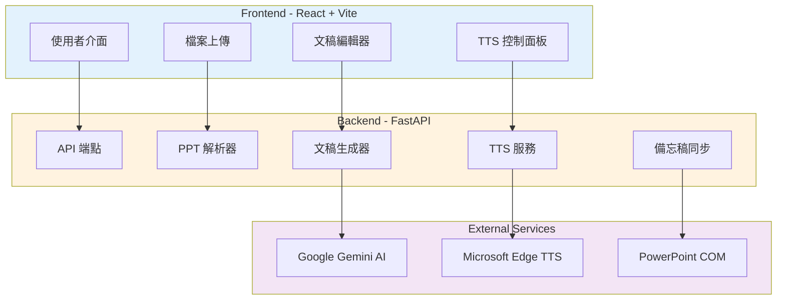
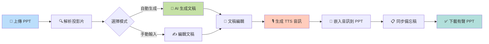

# 🎤 PPT 演講文稿生成器

自動根據 PowerPoint 簡報生成專業演講文稿的 Web 應用程式。使用 Google Gemini AI 驅動，專為繁體中文演講優化。

  

## ✨ 功能特色

- 🤖 **AI 智能生成**：使用 Google Gemini AI 生成自然流暢的演講文稿
- 🎙️ **高品質 TTS**：整合 Microsoft Edge TTS，支援多種語音和語言
- 📋 **自動備忘稿同步**：使用 PowerPoint COM 自動化同步備忘稿
- 📝 **多種設定**：支援不同聽眾對象、語氣風格、情境設定
- 🎯 **專業結構**：自動生成開場白、逐頁講稿、轉場語
- 🎬 **自動播放設定**：自動配置音訊播放和投影片轉場
- 💾 **便捷導出**：一鍵複製或下載 TXT 格式
- 🎨 **精美介面**：現代化 UI 設計，支援響應式布局
- 🔧 **模組化架構**：清晰的程式碼結構，易於維護和擴展
- 🌍 **多語言支援**：支援繁體中文、簡體中文、英文、日文、越南文等

## 📊 系統架構



## 🔄 工作流程



## 🏗️ 專案架構

```
PPT_Presentation_Script/
├── frontend/              # React 前端
│   ├── src/
│   │   ├── components/   # UI 組件
│   │   ├── services/     # API 服務
│   │   ├── App.jsx       # 主應用
│   │   └── index.css     # 樣式系統
│   └── package.json
│
├── backend/              # Python FastAPI 後端
│   ├── app/
│   │   ├── main.py      # API 入口
│   │   ├── services/    # 核心服務
│   │   └── models/      # 資料模型
│   ├── prompts/         # Prompt 模板
│   └── requirements.txt
│
├── uploads/             # PPT 上傳目錄
└── outputs/             # 文稿輸出目錄
```

## 🚀 快速開始

### 環境需求

- Python 3.8+
- Node.js 16+
- Google Gemini API Key

### 1. 後端設置

```bash
# 進入後端目錄
cd backend

# 安裝 Python 依賴
pip install -r requirements.txt

# 設置環境變數
cp .env.example .env
# 編輯 .env 填入您的 GEMINI_API_KEY

```bash
# 啟動後端服務
python -m uvicorn app.main:app --reload --port 8000
```

後端將運行在 `http://localhost:8000`

### 2. 前端設置

```bash
# 進入前端目錄
cd frontend

# 安裝依賴
npm install

# 啟動開發服務器
npm run dev
```

前端將運行在 `http://localhost:5173`

## 📚 使用說明

### 基本流程

#### 1️⃣ 上傳 PPT

點擊「選擇檔案」或拖放 .ppt/.pptx 檔案到上傳區域

<div align="center">


</div>

系統會自動解析投影片內容，顯示投影片資訊和縮圖

<div align="center">


</div>

---

#### 2️⃣ 設定參數

在右側「文稿設定」面板中配置生成參數：

- **聽眾對象**：例如：高階主管、客戶代表、內部團隊
- **簡報目的**：例如：產品介紹、進度報告、技術分享
- **簡報情境**：正式會議、內部分享、客戶簡報
- **語氣風格**：專業自然、輕鬆友善、熱情濃烈
- **預計時長**：設定演講的目標時間（分鐘）
- **輸出語言**：繁體中文、簡體中文、英文等

<div align="center">


</div>

---

#### 3️⃣ 生成文稿

點擊「生成文稿」按鈕，AI 會自動生成：

- 🎯 **開場白**：吸引聽眾注意力的開場
- 📝 **逐頁講稿**：每張投影片的詳細說明
- 🔗 **轉場語**：投影片間的自然連接（可選）

生成後可以：
- ✅ 即時預覽生成結果
- ✏️ 手動編輯和調整內容
- 📋 一鍵複製到剪貼簿
- 💾 下載為 TXT 檔案

<div align="center">


</div>

---

#### 4️⃣ 生成有聲 PPT（選用）

如果需要生成帶有音訊旁白的 PPT：

1. **選擇 TTS 語音**
   - 支援多種中文、英文語音
   - 可預覽語音效果

2. **調整音訊參數**
   - 語速：-50% 至 +100%
   - 音調：-50Hz 至 +50Hz

3. **生成和下載**
   - 點擊「生成有聲 PPT」
   - 系統會自動：
     - 🎙️ 生成 TTS 音訊
     - 🔗 嵌入音訊到 PPT
     - 📋 同步備忘稿
     - ⏱️ 設定自動播放
   - 下載完成的有聲 PPT

---

## ⚙️ 相關設定

### Google Gemini API 設定

在設定面板中配置您的 Google Gemini API 金鑰：

<div align="center">


</div>

**配置步驟：**
1. 點擊設定選單中的「Google Gemini」
2. 輸入您的 API 金鑰
3. 選擇模型（預設：gemini-flash-latest）
4. 點擊「儲存」完成配置

> 🔑 **取得 API 金鑰**：前往 [Google AI Studio](https://aistudio.google.com/app/apikey) 建立免費 API 金鑰

---

### TTS 語音設定

調整文字轉語音的參數：

<div align="center">


</div>

**可調整項目：**
- **語音語言**：選擇輸出語言（中文、英文等）
- **語音模型**：選擇不同的語音角色（男聲、女聲）
- **語速**：調整說話速度（-50% 至 +100%）
- **音調**：調整聲音高低（-50Hz 至 +50Hz）

---

### 語言切換

系統支援多種介面語言：

<div align="center">


</div>

**支援語言：**
- 🇹🇼 繁體中文 (Traditional Chinese)
- 🇺🇸 英文 (English)
- 🇯🇵 日文 (Japanese)
- 🇻🇳 越南文 (Tiếng Việt)

點擊右上角的地球圖示即可切換介面語言。

4. **使用結果**
   - 切換查看完整文稿或分段內容
   - 一鍵複製到剪貼簿
   - 下載為 TXT 檔案

## 🔧 Prompt 模板系統

本專案使用模組化的 Prompt 模板，所有模板位於 `backend/prompts/` 目錄：

- `system.md` - 系統總控 Prompt
- `opening.md` - 開場白生成
- `slide.md` - 逐頁講稿生成
- `transition.md` - 轉場語生成
- `multiversion_opening.md` - 多版本開場
- `rewrite.md` - 文稿改寫
- `qa.md` - 品質檢查

### Prompt 變數替換

模板使用 `{{variable}}` 格式定義變數，例如：

```markdown
- audience：{{audience}}
- purpose：{{purpose}}
- tone：{{tone}}
```

### 自定義 Prompt

您可以直接編輯 `.md` 檔案來調整生成邏輯，無需修改程式碼。

## 🎨 前端技術

- **框架**：React 18 + Vite
- **樣式**：Vanilla CSS with CSS Variables
- **設計**：現代化暗色主題，漸層與動畫效果
- **響應式**：支援桌面與移動裝置

## 🔌 API 端點

### `POST /api/upload`
上傳 PPT 檔案並解析內容

**Request:** multipart/form-data
- `file`: PPT 檔案

**Response:**
```json
{
  "success": true,
  "file_id": "uuid",
  "slides": [...],
  "summary": {...}
}
```

### `POST /api/generate/{file_id}`
生成演講文稿

**Request Body:**
```json
{
  "audience": "一般聽眾",
  "purpose": "介紹內容",
  "context": "正式會議",
  "tone": "專業自然",
  "duration_sec": 300,
  "include_transitions": true
}
```

**Response:**
```json
{
  "opening": "...",
  "slide_scripts": [...],
  "full_script": "...",
  "metadata": {...}
}
```

### `GET /api/health`
健康檢查

## 📦 部署建議

### 開發環境
- 前端：Vite Dev Server
- 後端：Uvicorn with --reload

### 生產環境
- 前端：建議使用 Vercel 或 Netlify
- 後端：建議使用 Railway、Render 或 AWS
- 資料庫：可選 PostgreSQL 儲存歷史記錄
- 快取：可選 Redis 優化性能

## 🛠️ 故障排除

### 後端無法啟動
- 確認已安裝所有 Python 依賴
- 檢查 `.env` 中的 `GEMINI_API_KEY` 是否正確
- 確認 Python 版本 ≥ 3.8

### 前端無法連接後端
- 確認後端服務正在運行
- 檢查 `frontend/src/services/api.js` 中的 API_BASE_URL
- 確認 CORS 設定正確

### PPT 解析失敗
- 確認檔案格式為 .ppt 或 .pptx
- 檢查檔案是否損壞
- 查看後端日誌獲取詳細錯誤

### AI 生成品質不佳
- 調整 `backend/prompts/` 中的 Prompt 模板
- 檢查 PPT 內容是否足夠詳細
- 嘗試不同的參數設定

## 🔜 未來規劃

- [ ] 語音合成（TTS）功能
- [ ] 使用者帳號系統
- [ ] 歷史記錄管理
- [ ] 多語言支援
- [ ] 批量處理功能
- [ ] 自定義模板庫

## 📄 授權

MIT License

## 🤝 貢獻

歡迎提交 Issue 和 Pull Request！

---

**由 Google Gemini AI 驅動 | 專為繁體中文演講優化**
